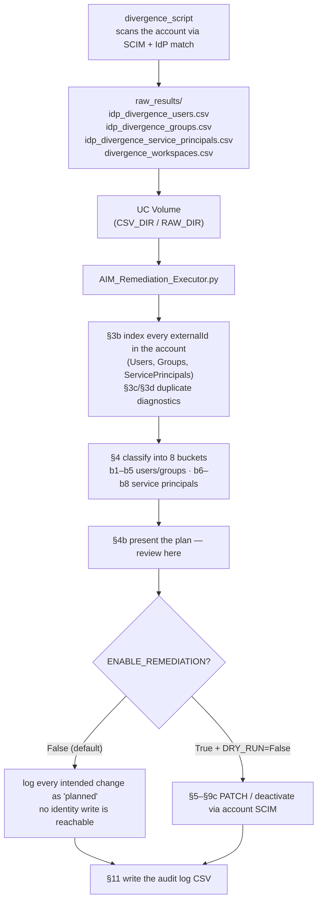

# AIM Migration — Remediation Package

`v0.1.0` · experimental / early-access

Tooling to find and fix the identity divergences that block a migration from **SCIM provisioning** to
**Automatic Identity Management (AIM)** on Databricks.

AIM matches each Databricks identity to Microsoft Entra ID by Entra's `objectId`, which Databricks stores as
that identity's `externalId`. When the two agree, AIM treats them as the same principal. When the `externalId`
is missing, wrong, or points at a deleted Entra object, AIM cannot make the match — and on next login it may
provision a **duplicate** principal, splitting permissions and history across two records.

This repo contains two tools that run **in sequence**:

1. **Scan first — `divergence_script/`** — the Databricks Knowledge Base *AIM enablement prep script*. Run it
   against your account to produce the divergence report (`raw_results/`). If you already ran the KB prep script,
   you can skip straight to stage 2 and feed its output in.
2. **Fix second — `AIM_Remediation_Executor.py`** — runs **on top of the scanner's results**. It classifies every
   divergence into eight buckets — five for users and groups, three for service principals — and applies the
   appropriate fix to each, safely and auditably.

> **You must run the scan before the fix.** The remediation notebook consumes the scanner's CSVs; it has no way to
> discover divergences on its own. Stage 1 → `raw_results/` → stage 2.

> **Data note — the CSVs here are pseudonymized.** Usernames, Databricks internal IDs, Entra `externalId`s,
> group names and workspace IDs in `raw_results/` and `processed_results/` have been replaced with synthetic
> values; email domains map to `example.com` (tenant-owned) and `example.net` (foreign tenant). Row counts,
> duplicate relationships and every `errorCategories` value are preserved, so the worklists show the real shape
> of a scan — but no value resolves to a real identity. They are **sample data**: replace them with your own
> scan output, and set `PRIMARY_DOMAINS` to your own domains, before running against a live account.

**Credit & sources:**
- The scanner in `divergence_script/` is Databricks' official **AIM enablement prep script**, authored by
  **Dinesh Pawar (Databricks)** and published in the Databricks Knowledge Base. All credit for the scan logic,
  the `errorCategories` taxonomy, and the output-CSV schema belongs to that article. It is repackaged here only
  to pair it with the remediation notebook.
  KB — *Automatic identity management (AIM) enablement prep script* (last published 2026-08-17):
  https://kb.databricks.com/automatic-identity-management-aim-enablement-prep-script
- Microsoft Learn — *Migrate to automatic identity management*:
  https://learn.microsoft.com/en-us/azure/databricks/admin/users-groups/automatic-identity-management/migrate-to-aim

---

## What's in here

```
divergence_script/                  Stage 1 scanner = Databricks KB "AIM enablement prep script" (Dinesh Pawar).
                                    Rename it to "divergence" when you upload it (see Step 1).
  run_divergence.py                 Notebook entry point — run this on a cluster.
  python/                           The package: config, auth, analyzers, CSV output.
    config.py                       <- the only file you edit
AIM_Remediation_Executor.py      The remediation notebook. Analysis-first, dry-run by default.
raw_results/                        Sample scanner output (what the scanner produces).
processed_results/                  Sample per-bucket worklists (what the notebook derives).
```

You do **not** need to run the scanner if you already have prep-script output — skip to
[Step 2](#step-2--put-the-csvs-where-the-notebook-can-read-them).

---

## How it works end to end



The scanner produces one row per divergent identity, tagged with an `errorCategories` value. The notebook turns
those categories into buckets, because **each category needs a different fix** — there is no single blanket PATCH
that resolves them all.

---

## The buckets, and how each fix works

Classification happens in §4 of the notebook, in this precedence order (a principal matching several categories
lands in the first bucket that applies). Buckets 1–5 cover users and groups; Buckets 6–8 cover service principals.

**Bucket numbers and section numbers deliberately do not line up.** Bucket numbers follow the order the scanner
reports categories; sections are ordered so the three scriptable fixes come first, then the no-write actions. So
Bucket 1 runs in §5, Bucket 2 in §7, Bucket 3 in §6, and the service-principal buckets in §9a–§9c. The table at
the end of this section lists the pairing.

### Bucket 1 — Name matches, link wrong or missing → **PATCH `externalId`**

`NAME_MATCH_EXTERNAL_ID_MISMATCH` with a populated `externalIdWithUsernameMatch`.

The Databricks username matches exactly one Entra identity, but the `externalId` is empty or points elsewhere —
typically created locally, or provisioned by SCIM without the `externalId`. Left alone, AIM provisions the Entra
identity as a *separate* principal.

**Fix:** PATCH the Databricks `externalId` to the matched Entra `objectId`. This is the one fully scriptable fix,
and it is what the KB prescribes. Before each write the notebook confirms no other principal already holds that
target (see [collision pre-check](#safety-model)). This bucket deliberately takes precedence over Buckets 4 and 5:
if a valid name-match target exists, linking it is better than treating the identity as stale.

### Bucket 2 — Username mismatch → **Databricks Support ticket**

`EXTERNAL_ID_MATCH_NAME_MISMATCH`.

The `externalId` maps to a real Entra user, but the Databricks username differs from that user's Entra name —
usually the email or UPN changed in Entra after provisioning. The link is valid; the name drifted.

**Fix:** first **reconcile duplicates** — run the §3c/§3d duplicate triage before you file anything. A UPN or
mail-nickname change in Entra often surfaces as two Databricks records for one person; resolve those there (link
the keeper, migrate the other, remove it) and drop them from the ticket, because a ticket cannot fix a duplicate.
For a genuine name drift, the username **cannot** be corrected through the API, so §7 generates a ready-to-send
support-ticket draft (`support_ticket_<run>.txt`) listing the affected users and their Entra `objectId`s. Keep
these users from logging in until it is corrected, because on next login the new name reads as a new person and a
duplicate is created against the same `externalId`. A correction is a coordinated change — see
[The name and email correction process](#the-name-and-email-correction-process-bucket-2) below for what it
involves and what to tell the affected users.

### Bucket 3 — Group name collisions → **link or rename**

Groups carrying `externalIdsWithGroupnameMatch`.

A local Databricks group's name matches an Entra group, but they are not linked by `objectId`. The Entra group
cannot provision at all, because the name is already taken.

**Fix:** where there is **exactly one** candidate Entra group, PATCH the group's `externalId` to link them —
but only if you opt in with `LINK_GROUPS = True`, since the default is to rename the local group in the console
instead. Where there are zero or several candidates the notebook logs `MANUAL_DECISION` and skips: an ambiguous
group needs a human. (In the sample data one group has 7 candidates.)

### Bucket 4 — Cross-tenant → **out of AIM scope, escalate**

`EXTERNAL_ID_NOT_IN_IDP` where the username domain is **not** in `PRIMARY_DOMAINS`.

These principals live in a *foreign* Entra tenant. AIM is single-tenant, so it cannot manage them at all.

**Fix:** by default, keep them on SCIM — AIM cannot provision another tenant's identities. §8 logs each as an
InfoSec escalation and makes no changes. If you are decommissioning SCIM, these identities lose their only
provisioning path: coordinate with your Entra admin, confirm each one is no longer needed, then remove or
deactivate it in Databricks by hand. Note this split is a **domain heuristic** keyed off `PRIMARY_DOMAINS`, not
the authoritative Entra home tenant, so review the §4b domain breakdown before acting on a borderline row.

### Bucket 5 — Stale / deleted → **review and quarantine (not bulk deactivation)**

`EXTERNAL_ID_NOT_IN_IDP` where the domain **is** in `PRIMARY_DOMAINS`.

The stored `externalId` points at an Entra object that no longer exists — almost always a user deleted from
Entra. Usually the largest bucket, and **not a migration blocker**: these records cannot log in, and AIM
reconciles `externalId` on its own.

**Fix:** verify first, then decide. Verify each id in Entra — a changed-email user is not stale, just renamed
(that is Bucket 2). Bulk deactivation is **not** KB-prescribed, and a renamed user looks identical here to a
deleted one, so blind deactivation risks locking out real people. The notebook logs every row as `REVIEW_ONLY` by
default. For the ones you confirm are gone, deactivate through the gated path (`CONFIRM_DEACTIVATION = True`,
domain-guarded, capped at `DEACTIVATION_BATCH_LIMIT` — default 25 — per run); this is reversible from the audit
log. Deleting a record is an optional, manual, non-reversible final step once you are certain. If in doubt, leave
it — AIM will not provision a dead `externalId`.

### Bucket 6 — Service principal matches one Entra application → **PATCH `externalId`**

`NAME_MATCH_EXTERNAL_ID_MISMATCH` on a service principal with a populated `externalIdWithAppIdMatch`.

The service-principal form of Bucket 1: exactly one Entra application-ID match exists, but the Databricks
`externalId` is empty or points elsewhere. Left alone, AIM provisions a duplicate service principal on next use.

**Fix:** PATCH the service principal's `externalId` to the matched Entra `objectId`, through the same collision
pre-check as Bucket 1 (run against the ServicePrincipals index). This is **opt-in** — set
`LINK_SERVICE_PRINCIPALS = True`, mirroring `LINK_GROUPS`. The default skips each row and logs `LINK_DISABLED`.
Clearing a service principal's `externalId` is not supported, only setting it.

### Bucket 7 — Service principal name drifted → **Databricks Support ticket**

`EXTERNAL_ID_MATCH_NAME_MISMATCH` on a service principal.

The `externalId` maps to a real Entra service principal, but the Databricks name differs.

**Fix:** as in Bucket 2, reconcile duplicates in §3c/§3d first, then escalate only genuine name drifts — only
Support can correct the name. §9b writes `support_ticket_sps_<run>.txt` listing each `applicationId` alongside its
Entra `objectId`, and makes no identity write. Send it through the same Support process as the Bucket 2 user
ticket.

### Bucket 8 — Service principal link points at nothing → **review only**

`EXTERNAL_ID_NOT_IN_IDP` on a service principal.

**Fix:** verify first, then decide — the counterpart to Bucket 5, but with no scripted deactivation. Service
principals have no email domain, so there is no owned-versus-foreign split as in Buckets 4 and 5, and clearing
`externalId` is groups-only. §9c logs each row as review-only and changes nothing. Verify each one in Entra; for
the ones you confirm are gone, deactivate or remove the service principal by hand in the account console.
Otherwise leave it and let AIM reconcile.

### Plus: group membership divergences

`GROUP_HAS_LOCAL_MEMBERS_WITHOUT_EXTERNAL_ID` and `GROUP_HAS_LOCAL_MEMBERS_WITH_EXTERNAL_ID`. No bucket patches
group membership, because external groups are read-only in Databricks and AIM drives their membership from Entra.

§6b turns these two categories into a review sheet (`group_membership_triage_<run>.csv`): for each flagged group it
lists the member IDs, classifies each as a user, service principal or nested group, and prints the suggested
Entra-side action. The common case is a **nested group** — the fix is to add and link the child group, not to
flatten its members into the parent. The sheet needs the raw groups file, so run in `raw` or `auto` input mode; the
pre-made `remediation_3_*.csv` does not carry the membership columns.

### Plus: workspaces without identity federation

`IDENTITY_FEDERATION_DISABLED` in `divergence_workspaces.csv`. AIM only applies in identity-federated workspaces.
§10 lists these; enabling federation is a manual step in the account console.

| Bucket | § | Principal | Finding | Mechanism | Owner / gate |
|---|---|---|---|---|---|
| 1 | 5 | User | Single clear IdP match | PATCH `externalId` via account SCIM (scriptable) | Account admin |
| 2 | 7 | User | Username mismatch | Reconcile duplicates (§3c/§3d) first, then Databricks Support ticket | Support |
| 3 | 6 | Group | Group name collision | Link (PATCH) or rename local group | Admin; `LINK_GROUPS`; ambiguous ones manual |
| 4 | 8 | User | Cross-tenant | Keep on SCIM by default; remove by hand only if decommissioning SCIM | InfoSec + Entra admin decision |
| 5 | 9 | User | Stale / deleted | Verify in Entra, then deactivate (gated, reversible); optional manual delete | Account admin; `CONFIRM_DEACTIVATION` |
| 6 | 9a | Service principal | Single clear application-ID match | PATCH `externalId` via account SCIM (scriptable) | Account admin; `LINK_SERVICE_PRINCIPALS` |
| 7 | 9b | Service principal | Name mismatch | Reconcile duplicates (§3c/§3d) first, then Databricks Support ticket | Support |
| 8 | 9c | Service principal | Stale / unknown link | Verify in Entra, then deactivate or remove by hand | Account admin |
| — | 6b | Group members | Local or unlinked members | Fix in Entra; triage sheet only | Account admin (Entra side) |
| — | 10 | Workspace | Workspace not federated | Enable identity federation | Account admin |

---

## The name and email correction process (Bucket 2)

First make sure these are genuine name drifts, not duplicates. Run the §3c/§3d duplicate triage before you file
anything: a UPN or mail-nickname change often surfaces as two records for one person, which you resolve there —
not through Support. A correction applies only to a user with a single record whose name drifted.

A Bucket 2 correction is not an instant fix. Databricks Support renames the affected users, and you make the
matching change in your identity provider. Plan a maintenance window and set expectations with the users first.
The notebook carries the same guidance in §7b, so you can share it from there without leaving the run.

**The process:**

1. Open the Support ticket with the affected users and their Entra `objectId`s (the draft from §7).
2. Agree a maintenance window with Support. A large batch takes longer to schedule.
3. During the change, pause identity sync: turn off just-in-time (JIT) provisioning and AIM in Databricks, and
   pause SCIM provisioning in your identity provider (Entra, Okta, and so on).
4. Support renames the users. For a large batch, a dry run may run first.
5. Make the matching rename in your identity provider.
6. Verify, using the checklist below.

**What to tell the affected users before the change:**

- An email or username change applies to every account and workspace in the same cloud that the user belongs to.
  A per-account change is not supported.
- The new email must not already exist anywhere in Databricks. Two records cannot be merged. If the new email
  already exists, either keep the new record and move resources to it before deleting the old one, or have the
  existing new email renamed aside first — in which case resources on the set-aside record are lost unless
  home-folder content is moved to shared folders beforehand.
- Casing matters. Addresses that differ only in case are treated as different users. On Azure, the old and new
  addresses must both be lowercase.
- Home folders are renamed to the new name, but path references inside jobs, repos, and notebooks are not
  rewritten. Home-folder updates can take up to a day.
- Existing personal compute clusters are orphaned. Create new ones under the new name after the change.
- Repos keep their old names and are not migrated automatically.

**Verification — confirm each user:**

- The user can log in.
- The user can reach their home folder and every saved notebook, query, and dashboard.
- The user has the same permissions and access as before the change.

---

## Prerequisites

- You are a Databricks **account admin**.
- An **account-level service principal** with an OAuth secret, stored in a Databricks **secret scope**
  (default name `divergence`) under the keys `client_id` and `client_secret`. Both the scanner and the notebook
  read credentials from there; nothing is ever hard-coded.
- A cluster with `databricks-sdk` available (`%pip install databricks-sdk` if not).
- A **UC Volume** you can read and write, to hold the CSVs and the notebook's output.

---

## Step 1 — Run the scanner (skip if you already have prep-script output)

> `divergence_script/` **is** the Databricks Knowledge Base *AIM enablement prep script* (author: Dinesh Pawar).
> Its folder layout matches the KB's `divergence` ZIP exactly (`python/config.py`, `run_divergence`, `results/`).
> If you already have prep-script output, skip to [Step 2](#step-2--put-the-csvs-where-the-notebook-can-read-them).
> Full setup, output-column definitions, and the error-category reference live in the KB:
> https://kb.databricks.com/automatic-identity-management-aim-enablement-prep-script

1. Upload the `divergence_script/` folder to your workspace and **rename it to `divergence`**. The entry point
   imports `divergence.python.__main__`, so the folder name matters. `run_divergence.py` must stay inside it:

   ```
   /Workspace/Users/you@example.com/aim/
     divergence/
       run_divergence.py
       python/...
   ```

2. Edit `divergence/python/config.py`:

   ```python
   ACCOUNTS_HOST = "https://accounts.azuredatabricks.net"
   ACCOUNT_ID    = "<your-account-id>"
   SECRET_SCOPE  = "divergence"
   ```

   Optionally narrow the scan with `INCLUDE_USERS` / `INCLUDE_GROUPS` / `INCLUDE_SERVICE_PRINCIPALS`, or check a
   handful of specific identities with `TARGET_IDENTITIES`.

3. Open `run_divergence.py` as a notebook and run it. It must run **on a Databricks cluster** — credentials come
   from `dbutils.secrets`. It works in three phases: list workspaces, gather every SCIM identity, then match each
   one against the IdP. Long scans are **resumable** — progress is checkpointed to
   `idp_divergence_progress.json`, so a re-run skips work already completed.

4. Results land in `divergence/results/`:

   | File | Contents |
   |---|---|
   | `idp_divergence_users.csv` | One row per divergent user: `id, username, externalId, externalIdWithUsernameMatch, errorCategories` |
   | `idp_divergence_groups.csv` | Divergent groups, incl. `externalIdsWithGroupnameMatch` and local-member columns |
   | `idp_divergence_service_principals.csv` | Divergent service principals |
   | `divergence_workspaces.csv` | Workspaces with identity federation disabled |
   | `idp_divergence_failures.csv` | Identities that errored after all retries — **should be empty** |
   | `identities_to_process_*.csv` | Every identity scanned (the denominator for your divergence rate) |

   Check `idp_divergence_failures.csv` is empty before trusting the worklists. If it has rows, the scan is
   incomplete and the counts understate reality.

---

## Step 2 — Put the CSVs where the notebook can read them

The notebook reads from two configurable folders and **writes its outputs to `CSV_DIR`**, so that path must be
writable. A UC Volume is recommended.

### Simplest layout (recommended): one folder for everything

Copy the scanner's output into a single Volume folder and point both variables at it:

```
/Volumes/<catalog>/<schema>/<volume>/aim_remediation/
    idp_divergence_users.csv                   ← from the scanner
    idp_divergence_groups.csv                  ← from the scanner
    idp_divergence_service_principals.csv      ← from the scanner (Buckets 6–8)
    divergence_workspaces.csv                  ← from the scanner
```

```python
CSV_DIR = "/Volumes/<catalog>/<schema>/<volume>/aim_remediation"
RAW_DIR = CSV_DIR
```

The notebook finds no pre-made worklists, so it derives all eight buckets from the raw files itself and writes
them back into the same folder for review. This is the path to use for a first run.

### Split layout (if you already have pre-made worklists)

If someone has already segmented the scan into `remediation_*.csv` files, keep them separate from the raw output:

```
/Volumes/<catalog>/<schema>/<volume>/aim_remediation/
    remediation_1_users_PATCH_externalid.csv
    remediation_2_users_SUPPORT_ticket.csv
    remediation_3_groups_name_collision.csv
    remediation_4_users_CROSS_TENANT_escalate.csv
    remediation_5_users_STALE_deactivate.csv
    remediation_6_sps_PATCH_externalid.csv         ← optional (see below)
    remediation_7_sps_SUPPORT_ticket.csv           ← optional
    remediation_8_sps_STALE_review.csv             ← optional
    divergence_workspaces.csv                      ← see the gotcha below
    raw_results/
        idp_divergence_users.csv
        idp_divergence_groups.csv
        idp_divergence_service_principals.csv
```

```python
CSV_DIR = "/Volumes/<catalog>/<schema>/<volume>/aim_remediation"
RAW_DIR = f"{CSV_DIR}/raw_results"
```

**Which files does it actually need?** In raw mode, `idp_divergence_users.csv` and `idp_divergence_groups.csv`.
In pre-made mode, all five of `remediation_1..5_*.csv`. Everything else is optional and degrades gracefully:
`idp_divergence_service_principals.csv` missing means Buckets 6–8 are simply empty, the three
`remediation_6..8_*.csv` are loaded best-effort in pre-made mode (a missing one counts as zero rows), and
`divergence_workspaces.csv` missing means §10 reports it and continues.

> **Gotcha:** §10 reads `divergence_workspaces.csv` from `RAW_DIR` in raw mode but from `CSV_DIR` in pre-made
> mode. If you use the split layout, put a copy in `CSV_DIR` too, or accept a harmless "not found" message.
> The one-folder layout avoids this entirely.

**How the notebook decides which mode to use** — `INPUT_MODE = "auto"` (the default) checks whether **all five**
user and group `remediation_1..5_*.csv` exist in `CSV_DIR`. If they all do it loads them; otherwise it derives the
buckets from `RAW_DIR`. Detection is all-or-nothing, so a partial set safely falls back to raw rather than
half-loading. The service-principal worklists are deliberately excluded from that check, so an older pre-made drop
without them stays valid. Force either path with `INPUT_MODE = "premade"` or `"raw"`.

Note that §6b's group membership triage needs the **raw** groups file, since the pre-made `remediation_3_*.csv`
does not carry the membership columns. Pure pre-made runs skip that sheet.

You can also point `RAW_DIR` straight at the scanner's workspace folder
(`/Workspace/.../divergence/results`) and skip the copy, as long as `CSV_DIR` remains writable.

---

## Step 3 — Configure the notebook

Import `AIM_Remediation_Executor.py` into your workspace and edit §2:

```python
ACCOUNT_ID      = "<your-account-id>"     # from the account console URL
SECRET_SCOPE    = "divergence"            # holds client_id / client_secret
CSV_DIR         = "/Volumes/.../aim_remediation"
RAW_DIR         = CSV_DIR
PRIMARY_DOMAINS = ["yourcompany.com"]     # ← set this; it drives the Bucket 4/5 split
```

`PRIMARY_DOMAINS` is the one value people forget. Any username whose domain is **not** listed is treated as
cross-tenant and routed to escalation instead of deactivation — so an incomplete list is fail-safe, but a wrong
one will misclassify. It applies to users only; service principals have no domain.

Two link gates are **opt-in** and stay off unless you set them: `LINK_GROUPS` for Bucket 3 and
`LINK_SERVICE_PRINCIPALS` for Bucket 6. Leave them `False` for the first live run, then enable them deliberately.

Optionally, §3d can enrich the duplicate triage sheet with Entra data by setting `GRAPH_ENABLED = True`,
`GRAPH_TENANT_ID`, and adding `graph_client_id` / `graph_client_secret` to the secret scope. Leave it `False` if
you have no Graph credentials — the sheet still ranks candidates by active status, group count and creation date.

---

## Step 4 — Analysis-only run (safe, start here)

Run the whole notebook top to bottom, leaving every safety flag at its default. With `ENABLE_REMEDIATION = False`,
**no identity write is reachable at all**, whatever `DRY_RUN` says. The run will:

- index every `externalId` in your account — users, groups and service principals — and report duplicates (§3b–§3d);
- classify the divergences and **present the plan** in §4b — per-bucket counts, the error-category distribution,
  the domain split behind the Bucket 4/5 decision, the full service-principal plan, and any rows it could not
  classify;
- write the read-only triage sheets (§3d duplicates, §6b group membership) and the two Support-ticket drafts;
- print every intended change with a `[DRY]` prefix and record it in the audit log as `status = "planned"`.

Read §4b carefully. This is the review checkpoint: confirm the bucket counts are what you expect, that the domain
split looks right, and that `b_unclassified` and `sp_unclassified` are empty.

## Step 5 — Dry run with remediation enabled

Set `ENABLE_REMEDIATION = True`, leave `DRY_RUN = True`, re-run. Same output as Step 4, but now every planned
PATCH has also passed the collision pre-check against the live directory. Review `audit_log_<run>.csv`.

## Step 6 — Execute

Set `DRY_RUN = False` and re-run. Bucket 1 performs its PATCHes. Bucket 3 links groups only if you also set
`LINK_GROUPS = True`, and Bucket 6 links service principals only if you set `LINK_SERVICE_PRINCIPALS = True`. Each
call is throttled and logged with its previous `externalId` so it can be reversed. Buckets 2, 4, 5, 7 and 8 still
make no changes; they are inherently manual. Sections 5–9c are independent, so you can re-run one bucket at a time.

## Step 7 — Finish the manual work

1. File the Bucket 2 support ticket, holding those users off login until it is resolved.
2. File the Bucket 7 service-principal ticket (`support_ticket_sps_<run>.txt`) through the same process.
3. Resolve Bucket 3's ambiguous groups by hand.
4. Work through the §6b membership triage sheet **in Entra** — link and add nested child groups rather than
   flattening their members.
5. Escalate Bucket 4 to InfoSec for a disposition; they stay on SCIM.
6. Enable identity federation on the workspaces from §10.
7. Leave Buckets 5 and 8 alone unless individually verified in Entra.
8. Run §12 after AIM is enabled to confirm it is provisioning identities.
9. Only then gate the SCIM disable on: `externalId` alignment, no local group-membership modifications, and no
   nested-group reliance.

Throughout, enable AIM **in parallel with SCIM**. There is no big-bang cutover; retire SCIM last.

---

## Safety model

- **`ENABLE_REMEDIATION = False` (master gate).** The default. No identity write is reachable in this state, so
  the notebook can always be run end to end just to analyse.
- **`DRY_RUN = True`.** The second gate. Both must be satisfied before anything is written.
- **Collision pre-check (`COLLISION_PRECHECK = True`).** §3b pages your entire account directory once and indexes
  every `externalId` across users, groups and service principals. Before each PATCH the notebook confirms no other
  principal already holds the target. It **fails closed** — if the index cannot be built, every PATCH is skipped
  rather than risked. The service-principal index carries its own readiness flag (`SP_INDEX_OK`), so a failure
  there cannot silently green-light a Bucket 6 link.
- **`LINK_GROUPS = False`.** Group linking is opt-in; the default leaves groups for a console rename.
- **`LINK_SERVICE_PRINCIPALS = False`.** Service-principal linking is opt-in too; the default logs `LINK_DISABLED`
  and skips.
- **`CONFIRM_DEACTIVATION = False` + `DEACTIVATION_BATCH_LIMIT = 25`.** Bucket 5 deactivation is double-gated,
  domain-guarded and batch-capped. It is the only deactivation path — Bucket 8 has none.
- **Everything is logged.** Every intended or executed call is recorded with its previous `externalId`
  (normalised, so a blank truly means "was empty") — this is the rollback record.
- **No secrets in code.** Credentials are read from the secret scope at runtime.

### Outputs written to `CSV_DIR`

These are local file writes and never touch identities — they happen in every mode.

| File | What it is |
|---|---|
| `audit_log_<run>.csv` | Every action planned or taken. The rollback record; see §11 for the column dictionary. |
| `remediation_1..5_*.csv` | The derived user and group worklists (raw mode, when `WRITE_DERIVED_WORKLISTS = True`). |
| `remediation_6..8_*.csv` | The derived service-principal worklists, same mode and flag. |
| `support_ticket_<run>.txt` | Ready-to-send Bucket 2 ticket draft (users). |
| `support_ticket_sps_<run>.txt` | Ready-to-send Bucket 7 ticket draft (service principals). |
| `duplicate_externalids_<run>.csv` | Every `externalId` held by more than one principal (§3c). |
| `duplicate_triage_<run>.csv` | The same clusters enriched, with a suggested keeper per cluster (§3d). |
| `group_membership_triage_<run>.csv` | Flagged group members with type and suggested Entra action (§6b). |

The suggested keeper is a **heuristic, not a decision** — confirm it, and migrate assets and memberships to the
keeper, before removing any record.

### Rollback

§13 contains a gated, copy-paste rollback snippet covering every link bucket — 1, 3 and 6. Filter the audit log to
`status == "success"` and `action == "PATCH_externalId"`, then PATCH each `dbx_id` back to its `old_externalId`;
the snippet maps `principal_type` to the right SCIM collection. Note that clearing an `externalId` (setting it to
`""`) is **supported for groups only** — which is exactly why stale *users* are reviewed and quarantined rather
than un-tagged, and why the snippet skips any user or service principal whose prior value was blank. Bucket 5
deactivations reverse differently: reactivate them, rather than re-PATCHing an `externalId`.

---

## Troubleshooting

| Symptom | Cause / fix |
|---|---|
| `ModuleNotFoundError: divergence` | The scanner folder is still named `divergence_script`. Rename it to `divergence`, with `run_divergence.py` inside it. |
| `Invalid config.py` on scanner start | `ACCOUNT_ID`, `ACCOUNTS_HOST` or `SECRET_SCOPE` is empty or malformed in `config.py`. |
| Scanner fails reading secrets | It must run on a Databricks cluster; `dbutils.secrets` is unavailable locally. Confirm the scope holds `client_id` and `client_secret`. |
| `FileNotFoundError: idp_divergence_users.csv` | `RAW_DIR` is wrong. The notebook fails loudly here by design rather than silently producing empty worklists. |
| Everything shows `[SKIP] ... externalId index unavailable` | §3b could not page the directory, so the collision pre-check failed closed. Fix the auth/permission problem; do not set `COLLISION_PRECHECK = False` unless you accept the duplicate-identity risk. |
| All users land in Bucket 4 (cross-tenant) | `PRIMARY_DOMAINS` does not include your tenant's domains. |
| `(divergence_workspaces.csv not found ...)` | Non-fatal. Copy it into the folder the current input mode reads from (see the gotcha in Step 2). |
| Rows appear in `b_unclassified` or `sp_unclassified` | Divergences carrying an error category no bucket handles. §4b surfaces them; they are never silently dropped. Review before proceeding. |
| Every Bucket 6 row shows `[SKIP] SP ... LINK_SERVICE_PRINCIPALS=False` | Expected on a default run. Service-principal linking is opt-in — set `LINK_SERVICE_PRINCIPALS = True` once you have reviewed the plan. |
| Bucket 6 rows log `PRECHECK_ERROR` | The ServicePrincipals collision index did not build (`SP_INDEX_OK` is false). Re-run §3b and fix the auth or permission problem before linking. |
| `(no service-principal divergences to classify ...)` | Non-fatal. `idp_divergence_service_principals.csv` is absent from `RAW_DIR`, so Buckets 6–8 are empty. |
| §6b prints nothing | It needs the raw `idp_divergence_groups.csv` for the membership columns. Run with `INPUT_MODE = "raw"` or `"auto"`; pure pre-made runs cannot produce this sheet. |

---

## Reference

### Error categories produced by the scanner

| Category | Applies to | Handled by |
|---|---|---|
| `NAME_MATCH_EXTERNAL_ID_MISMATCH` | Users, service principals | Bucket 1 (§5), Bucket 6 (§9a) |
| `EXTERNAL_ID_MATCH_NAME_MISMATCH` | Users, service principals | Bucket 2 (§7), Bucket 7 (§9b) |
| `EXTERNAL_ID_NOT_IN_IDP` | Users, service principals | Buckets 4 and 5 (§8, §9), Bucket 8 (§9c) |
| `GROUP_HAS_LOCAL_MEMBERS_WITHOUT_EXTERNAL_ID` | Groups | §6b triage sheet — fixed in Entra |
| `GROUP_HAS_LOCAL_MEMBERS_WITH_EXTERNAL_ID` | Groups | §6b triage sheet — fixed in Entra |
| `IDENTITY_FEDERATION_DISABLED` | Workspaces | §10 — enable federation in the console |

Group name collisions (Bucket 3) are not a category; they come from a populated `externalIdsWithGroupnameMatch`.

### The PATCH the fix is built on (per the KB)

```
PATCH https://<accountUrl>/api/2.1/accounts/<accountId>/scim/v2/<Users|Groups|ServicePrincipals>/<databricksId>
{
  "schemas": ["urn:ietf:params:scim:api:messages:2.0:PatchOp"],
  "Operations": [ { "op": "replace", "path": "externalId", "value": "<targetExternalId>" } ]
}
```

### What the sample data shows

A real account scan: 2,504 users, 341 groups, 173 service principals, 0 scan failures. 1,129 users diverged
(45%), which resolved to 69 Bucket 1, 31 Bucket 2, 17 Bucket 4 and 1,012 Bucket 5 — plus 7 group collisions and
16 unfederated workspaces. The headline lesson: a scary-looking 45% was almost entirely stale `externalId` values,
not structural drift, and only 69 identities needed a scripted fix.

The eight service-principal rows in `idp_divergence_service_principals.csv` are **illustrative**, added so the
service-principal path has something to exercise: 3 land in Bucket 6, 2 in Bucket 7 and 3 in Bucket 8. Group
memberships came back clean in the real scan, so the §6b triage sheet comes out empty against this sample.

### Notebook revision history

**rev. 5** — extends remediation to service principals. The collision index, classification, analysis, audit log
and rollback now cover `ServicePrincipals` alongside users and groups, adding Bucket 6 (link on application-ID
match, gated by `LINK_SERVICE_PRINCIPALS`), Bucket 7 (Support ticket) and Bucket 8 (review only). The SP index
carries its own `SP_INDEX_OK` flag so it fails closed independently. Adds §6b, a read-only group membership triage
sheet for the two `GROUP_HAS_LOCAL_MEMBERS_*` categories that no bucket can patch.

**rev. 4** — accepts raw prep-script output directly (§4) and adds the §4b analysis presentation and the
`ENABLE_REMEDIATION` master gate, so the notebook can run end to end without being able to write.

**rev. 3** — replaced `dt.UTC` (3.11+ only) with `dt.timezone.utc`, which crashed on DBR 13.3/14.3 LTS before
anything ran. Rebuilt the collision check: the account Users list can only filter by `userName`, not
`externalId`, and pages at 100, so the old per-target filter was a silent no-op. It now pages the whole
directory once and checks locally, covering non-divergent principals too.

**rev. 2** — from an independent code review: added the collision pre-check; reframed Bucket 5 as
review/quarantine (double-gated, batch-capped); normalised `(empty)` to blank; made the primary-domain set
explicit with a Bucket 5 escalation guard; standardised the audit-log write path; surfaced the Entra `objectId`
in the ticket; printed federation-disabled workspaces inline.
